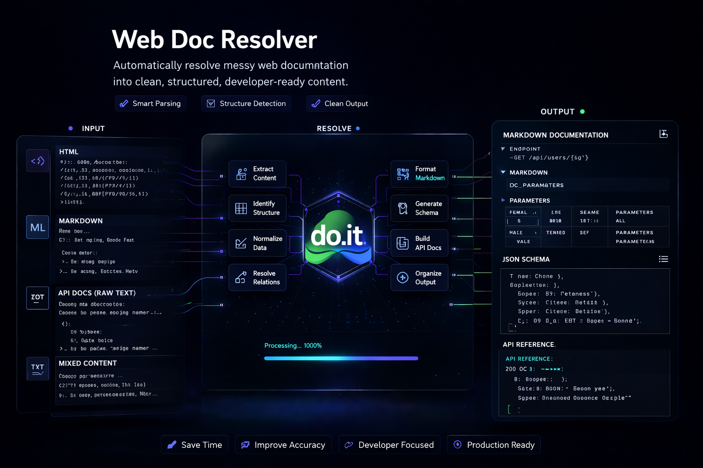

<div align="center">



# do-web-doc-resolver

**Resolve queries or URLs into compact, LLM-ready Markdown**

[](https://github.com/d-oit/do-web-doc-resolver/actions)
[](LICENSE)

</div>

## What it does

do-web-doc-resolver converts web pages and search queries into Markdown formatted for LLM ingestion. It implements a multi-stage cascade that prioritizes local caches and free services before using paid APIs.

## Installation

### Python

```bash
pip install -r requirements.txt
```

### Rust CLI

```bash
cd cli && cargo build --release
```

### Web UI

```bash
cd web && npm install --legacy-peer-deps
```

## Usage

### CLI (Python)

```bash
python -m scripts.cli "https://example.com"
python -m scripts.cli "search query"
```

### CLI (Rust)

```bash
./cli/target/release/do-wdr resolve "https://example.com"
```

### Web UI

```bash
cd web && npm run dev
```

## Resolution Cascade

The tool routes requests through a sequence of providers, stopping at the first successful result:

1. **Semantic Cache**: Local SQLite-vec database for similarity-based retrieval.
2. **Free Providers**: `llms.txt` detection, Jina Reader, and DuckDuckGo.
3. **Paid Providers**: Exa, Tavily, Firecrawl, and Mistral AI (requires configuration).
4. **Fallback**: Direct HTTP extraction.

## Environment Variables

Paid providers require the following environment variables:

| Variable | Service |
|---|---|
| `EXA_API_KEY` | Exa Search |
| `TAVILY_API_KEY` | Tavily Search |
| `FIRECRAWL_API_KEY` | Firecrawl Extraction |
| `MISTRAL_API_KEY` | Mistral AI Search/Browser |

## Testing

### Python Suite

```bash
python -m pytest tests/ -m "not live"
```

### Rust Suite

```bash
cd cli && cargo test
```

### Web UI Suite

```bash
cd web && npx playwright test --project=desktop
```

### Full Quality Gate

```bash
./scripts/quality_gate.sh
```

## License

MIT
