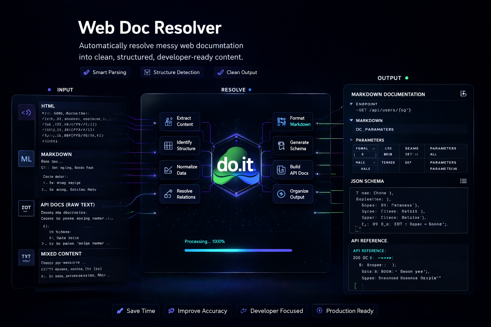

<div align="center">



# do-web-doc-resolver

**Resolve web queries and URLs into compact, LLM-ready Markdown.**

[](https://github.com/d-oit/do-web-doc-resolver/actions)
[](https://www.python.org/)
[](https://www.rust-lang.org/)
[](https://nextjs.org/)
[](LICENSE)

[**Live Demo**](https://web-eight-ivory-29.vercel.app) · [**Documentation**](docs/) · [**Report Bug**](https://github.com/d-oit/do-web-doc-resolver/issues)

</div>

---

## Overview

`do-web-doc-resolver` fetches web pages and executes search queries, stripping HTML boilerplate and returning token-dense Markdown for LLM context windows. It evaluates results against content density and quality thresholds, executing a tiered fallback cascade across free and paid providers.

---

## What the Cascade Is

The resolver queries providers in priority tiers and halts upon receiving a response that satisfies quality scoring thresholds.

### Query Cascade Order

1. **Semantic Cache**: Local SQLite vector cache (`sqlite-vec`).
2. **Free Search Tier**: Exa MCP, Exa SDK, Tavily, DuckDuckGo.
3. **Paid Search Tier**: Serper, Mistral.

### URL Cascade Order

1. **Semantic Cache**: Local vector lookup.
2. **Free Static Tier**: `llms.txt` discovery.
3. **Free Direct & Lite Tier**: Direct HTTP fetch, Jina Reader, Firecrawl.
4. **Browser Tier**: Mistral Browser.

---

## How to Install

### Python

Requires Python 3.11 or higher.

```bash
git clone https://github.com/d-oit/do-web-doc-resolver.git
cd do-web-doc-resolver
pip install -r requirements.txt
```

### Rust CLI (`do-wdr`)

Requires Rust 1.80 or higher.

```bash
cd cli
cargo build --release
```

### Web UI

Requires Node.js 18 or higher.

```bash
cd web
npm install --legacy-peer-deps
```

---

## How to Run

### Python CLI

Pass a target URL or query as the positional argument:

```bash
python -m scripts.cli "https://docs.python.org/3/"
python -m scripts.cli "python asyncio taskgroup example"
```

### Python Module

```python
from scripts.resolve import resolve

result = resolve("https://docs.python.org/3/")
print(result["content"])
```

### Rust CLI (`do-wdr`)

```bash
./cli/target/release/do-wdr resolve "https://docs.python.org/3/"
./cli/target/release/do-wdr resolve "rust tokio tutorial"
```

### Web UI

```bash
cd web
npm run dev
# Open http://localhost:3000
```

---

## Environment Variables Required

Zero-configuration mode runs using free providers without API keys. Optional environment variables enable paid provider tiers:

| Environment Variable | Provider | Required | Description |
|---|---|---|---|
| `EXA_API_KEY` | Exa SDK | No | Enables Exa search and content extraction |
| `TAVILY_API_KEY` | Tavily | No | Enables Tavily web search |
| `SERPER_API_KEY` | Serper | No | Enables Google Search via Serper |
| `FIRECRAWL_API_KEY` | Firecrawl | No | Enables Firecrawl scraping |
| `MISTRAL_API_KEY` | Mistral AI | No | Enables Mistral Search and Mistral Browser |

---

## How to Run Tests

### Python Test Suite

```bash
pytest tests/ -v -m "not live"
```

### Rust Test Suite

```bash
cd cli && cargo test
```

### Web UI Playwright Tests

```bash
cd web && npx playwright test --project=desktop
```

### Quality Gate Script

```bash
./scripts/quality_gate.sh
```
